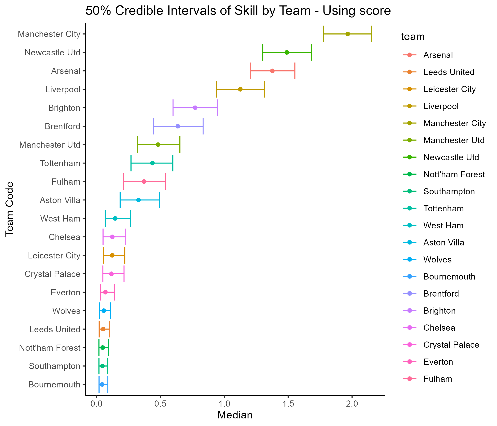
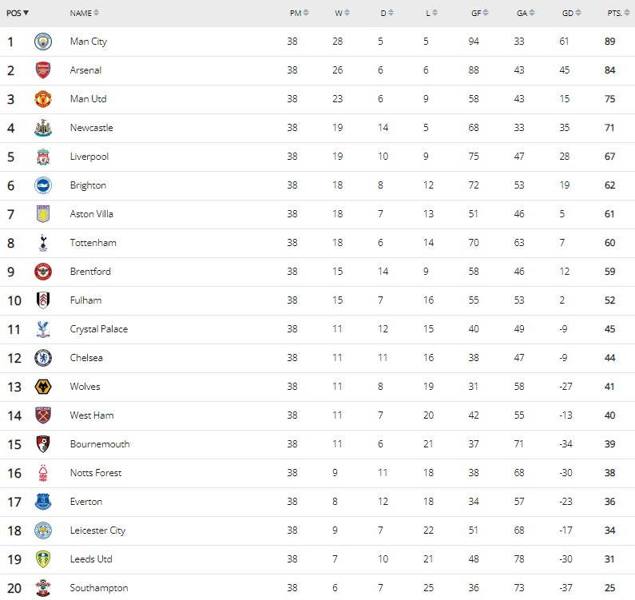
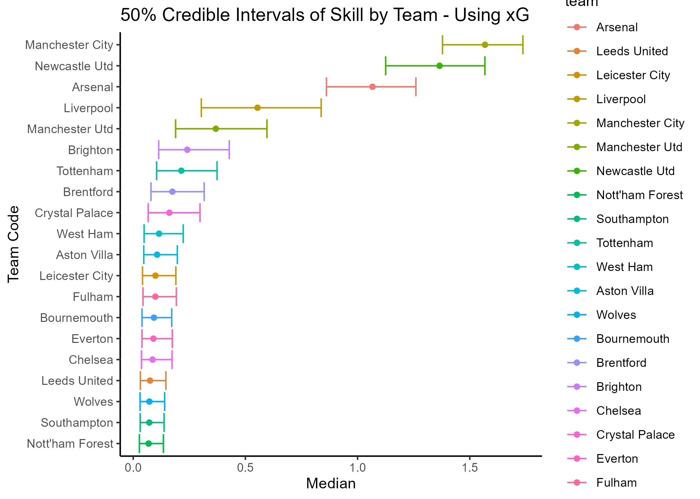

# Did Manchester United over-achieve in EPL 2022/2023  

* Author: Ranjit Sundaramurthi
* Attribution: [UBC-MDS DSCI 553](https://pages.github.ubc.ca/MDS-2022-23/DSCI_553_stat-inf-2_students/README.html)


After a poor start to the season with defeats against Brighton and Brentford in their opening two games of the Premier League 2022/2023 season, Manchester United seemed to be continuing their previous forgetful season form. The previous season they had finished 6th in the League and failed to qualify for the UEFA competition. With a 2021/2022 season with 58 points (their lowest tally), 56 conceded goals (their most conceded) and 16 wins (their fewest tally), things could only be expected to improve. However, the shaky start aggravated by the power battle between the new manager - Erik Ten Hag (ETH) and the talisman - Cristiano Ronaldo. ETH is often regarded as the next influential manager who can not only compete with the likes of Pep Guardiola and Jürgen Klopp, but also provide dynamic attacking football, a trait long associated with Manchester United. Those who follow EPL closely will agree the 2022/2023 season turned out to be roller coaster of a ride for Manchester United. With the ebbs and flows, Manchester United finished the season strongly  in third place and won the Carabao Cup trophy, their first trophy since 2016/2017 season.


In this article I assess the performance of premier league teams with their attack/defence polarity in comparison to the other league teams. What do I mean by attack/defence polarity? Consider that a Team A has very strong attack and a very strong defence. Team A is likely to score a lot of goals and concede minimal goals. Thus we can say that Team A has a high attack/defence polarity. On the contrary let's say that Team B has a very poor attack and a very poor defence. Then Team B is likely to have a very low (but positive) attack/defence polarity. You may ask why positive shouldn't it be negative? This is because we are only recording the attack/defence polarity of the winning teams in a game. That is one of the limitations of this analysis. All limitations will be summarized at the end of this article.

In my analysis the intangible attacking intent, hereafter referenced as `skill`, is represented by using two approaches using Bayesian modeling analysis. 
   * The first one uses the score difference as an indicator of the skill (attack/defence polarity) of the two participating teams. For instance if a league game result is 1-2 or 4-0, the score difference is 1 and 4 respectively for these games. The score difference is a computed as a positive number and is modeled to be a reflection of the disparity in skill levels of the participating teams.
   * The second one uses the expected goal difference as the indicator of the skill (attack/defence polarity) of the two participating teams. You can understand more about expected goals [here](https://theanalyst.com/na/2021/07/what-are-expected-goals-xg/). In short, as the name indicates expected goals is a metric that reflects the attacking intent of a team by capturing the context of the gameplay. It can be much different than the number of actual goals scored by a team depending on the turn of events during the game.
   
   You can find the details on the modeling procedure [here](src/code.Rmd). I will limit this article to the overall discussion peppering it with technical details as necessary for support. The code is adapted from the lab assignment from [DSCI-553](https://pages.github.ubc.ca/MDS-2022-23/DSCI_553_stat-inf-2_students/README.html) of MDS program at UBC.


### The Modeling


Now is the time to look away and jump to the next section, if you are not interested in the technical details!

To provide a brief explanation, in Bayesian modeling we use the Observed data as evidence to update the Prior knowledge to get the Posterior results. For instance, in the first approach the score difference is modeled as a Poisson distribution of the skill. This is the Prior distribution. The actual score differences during the season games are the observed evidences. These are used to update the Prior distribution using the Likelihood function. This is done over the several simulations, resulting in the Posterior distribution.

In the first approach, the score difference is a positive non-zero integer. The drawn games are eliminated from consideration. This enables us to model it as a Poisson distribution. The mean value of the score difference is given by $\lambda$. Thus a higher score difference implies a higher value of $\lambda$, which in turn implies a higher difference in the skill levels of the winning and losing team for that game. I create a functional representation of $\lambda$ such that it increases with the increase in difference in the skill levels of the winning and the losing team. Consequently the expected score difference also increases. This makes sense in the the context of the modeling a football game score outcome. One model that meet this criteria is as follows. This is be the Likelihood function. For details please refer [here](http://localhost:8888/lab/tree/premier_league_skill/src/code.Rmd).

$$\lambda_i = \log\big(1 + \exp(w_i - l_i)\big)$$

In the second approach, the expected goal difference is modeled. It is important to remember that the difference is modeled as subtracting the losing team's metric (xg) from that of the winning team's metric (xg). It is possible that the expected goal of the losing team is higher than that of the winning team. This happens rarely but it is a possible occurrence. Thus our modeling should enable negative and continuous expected goal differences. Thus the Normal distribution is chosen as a Prior distribution model for this scenario. The mean represents the latent skill of each team. For simplicity, the a unit variance is assumed. This can be further explored for improving the model in the future. Likewise the likelihood function should allow for negative values and hence I have offset the minimum value by adding an empirical -0.1 to the above equation. Thus the likelihood equation in this scenario is as below. This is another aspect of the modeling that can be improved or validated by further analysis.

$$\lambda_i = -0.1 + \log\big(1 + \exp(w_i - l_i)\big)$$


I then ran a R STAN simulation over 60,000 effective iterations drawing 2700 iteration samples at intervals of 20 simulations. Each drawn simulated sample represents the skill level of each of the teams in the league based on the posterior distribution of lambda based on the evidence, i.e. actual score difference observed during the 2022/2023 league games. Please note that the quality of the simulations is to be tested. This will be done in the near future. Presently, I will make inferences based on the current simulation results.   


### The Results


Now comes the interesting part where we compare the results of the simulation between the two scenarios.

Recall, that in the first approach we are using the score difference as an indicator of the skill (attack/defence polarity) of the winning team. I plot the 50 percentile values of the mean of the score difference, while using the mean value to rank the teams. Thus the team with the highest mean score difference is ranked first. It is seen that Manchester City are distinctly ahead as there is no overlap even in their 50 percentile values with the second ranked Newcastle United. There is close tussle though between Newcastle and Arsenal who come in third. Liverpool seem to be comfortably placed in fourth, while Brighton completes the top five position. 




Manchester United as way down in seventh position in terms of the attack/defence polarity skill based on this approach. Let's compare this ranking to the actual standings at the end of the EPL 2022/2023 season. The actual goals scored and conceded by Manchester United exposes the justification for this anomaly. Manchester United scored the least number of goals amongst the top six teams in the season and conceded the most amongst the top four. Consequently they have the worst goal difference in the top six teams as seen in the EPL standings table.

Thus in terms of the attack/defence polarity of Manchester United, they are justifiably below the top five rankings. If you followed their performances in the season you will be aware, Manchester United had a dearth of options for strikers with the exit of Cristiano Ronaldo. Furthermore, their attacking options - Sancho, Martial, Wout Weghorst either struggled with form or were injured for a significant portion of the season.




Now, let's bring the second approach results into the fray.

It is seen that Manchester City are still the clear favourites, however the gap is is reduced from the second placed Newcastle United. Arsenal still complete the top three pulling away from Liverpool and Manchester United who see to connect the top performers with the rest of the teams.

Let's compare the ranking from the expected goals (as an indicator of the attack/defence polarity) to the actual EPL standings in the season. It is clear that Manchester United's ranking in the second approach is a closer approximation to their actual seasonal ranking. Newcastle United and Liverpool are ranked higher in both the approaches than their actual season rankings.

Comparing the two approaches, it is seen that the skill based on expected goals tends to demarcate the top competing teams more definitely from the mid-table and lower teams. Thus the expected goal difference approach might be a better indicator of the attack/defence polarity as compared to the scored goal difference approach.




### Verdict on Manchester United


While there are limitations to the analysis as captured in another section, we can notice that Manchester United outperformed their expected ranking based on the skill of attack/defence polarity. This inference is further strengthened from the fact that they have more victories (23) as compared to Liverpool, Newcastle (19 each) or Brentford (15). Thus there are evidences (winning games) available to build confidence in the simulations. We can also argue to the contrary that there is comparatively less evidence for Liverpool, Newcastle and Brentford (due to lesser winning games than Manchester United). This is perhaps causing the model to provide a more pessimistic ranking for Manchester United and an optimistic ranking for Liverpool and Newcastle United.

The low attack/defence polarity is a reflection of the limited attacking influence of the Manchester United in their winning games. It indicates that Manchester United do not dominate to win their games, they are about good enough in relation to their opponent to garner a victory. On the other hand, teams like Manchester City, Newcastle United and Arsenal tend to dominate/control the game.

In conclusion, Manchester United's third place finish in the season despite a lower attack/defence polarity is appreciable and a remarkable achievement in the first season for their manager Erik Ten Hag.


### Limitations


* The skill is measured with respect to the winning team only. Thus if a team does not win any games in the season then this modeling will not compute the skill for that team.
* Drawn games provide points teams which contributes in the seasonal ranking. However the drawn games are eliminated from computation in this model. Thus if a team draws a lot of games, there will be a discrepancy in their rank evaluation based on this skill.  
* There is an imbalance in the observations per team. The teams having less wins in a season have less observations/evidence to influence their prior distribution.
* In the second approach the Likelihood equation uses an empirical measure to allow for negative values of the mean skill.
* In the second approach a unit variance is assumed. The variance can also modeling as a normal distribution allowing for hierarchical modeling exploration.
* The quality of the sampling needs to be tested with metrics.


### Data


The data is sourced specifically from [fbref](https://fbref.com/en/comps/9/schedule/Premier-League-Scores-and-Fixtures) which provides the results for every game played during the 2022/2023 season. The data was cleaned using R to design in the required format for further analysis. The cleaned dataset is found [here](data/epl_2022_2023_matches.csv). Thanks to [Fbref](https://fbref.com/en/) for providing up to date statistics that enables us derive interesting and rewarding insights.

```python

```
